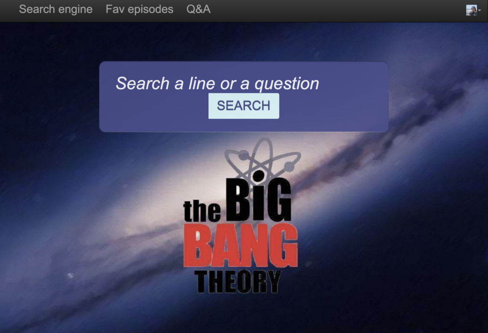

# SI650 Final Project: A Fun Search Engine for the Big Bang Theory 
**FA2021 @ University of Michigan**

This project aims at developing a fun retrieval system in the TV series domain. Specifically, we will focus on the Big Bang Theory. Our retrieval system will provide TV series lovers as well as the general audience with an easy-to-use interface to accurately search for quotes in any episode. Along with the search results we will provide tailored episodes recommendation for different users. Moreover, specially for the general audience, we will provide a question and answer section for them to quickly know more about the Big Bang Theory. The final deliverable will be an application interface with the aforementioned functionalities. 

